## Lab 2 - Content Generation

With Lambda@Edge, you go beyond modifying HTTP requests and response CloudFront receives from and sends to your viewers or your origin. Using your Lambda@Edge functions, you can generate content on the fly closest to your viewers without even going to an origin by returning a response from a Lambda@Edge function triggered by viewer-request or origin-request events.

In this lab, you will learn how to create a Lambda@Edge function that dynamically generates HTML content that can be cached by CloudFront and returned back to your viewers.

After the completion of [Lab 0 - Launch the Stack](../Lab0_LaunchTheStack/README.md) and [Lab 1 - Security](../Lab1_Security/README.md), your CloudFront distribution just points to an S3 bucket with some static HTML content and jpeg images.

We will create two Lambda@Edge functions:
* The first function will generate a simple HTML page with card details which will be available at the URL like this:
https://d123.cloudfront.net/card/da8398f4 (currently, it shows `404 Not Found` from S3)
* The second function will generate a new dynamic home page, available at https://d123.cloudfront.net. The home page will show details about each of the displayed cards - description and the current rating score. It will also sort the cards so that the most popular ones are displayed at the top.

**NOTE:** Here and below throughout the workshop, replace the example domain name `d123.cloudfront.net` with the unique domain name of your distribution.

We will generate the content in Lambda@Edge functions triggered by origin-request event so that the generated HTML files can be cached by CloudFront. Even if the TTL is just a few seconds, it will still absorb traffic spikes and lower the number of function executions.

## Steps

[1. Content generation for the card details page](#1-content-generation-for-the-card-details-page)  
[1.1 Create a Lambda function](#11-create-a-lambda-function)  
[1.2 Validate the function works in Lambda Console](#12-validate-the-function-works-in-lambda-console)  
[1.3 Publish a function version](#13-publish-a-function-version)  
[1.4 Create the trigger](#14-create-the-trigger)  
[1.5 Wait for the change to propagate](#15-wait-for-the-change-to-propagate)  
[1.6 The generated card details page is now served by CloudFront](#16-the-generated-card-details-page-is-now-served-by-cloudfront)  

[2. Content generation for the home page](#2-content-generation-for-the-home-page)  
[2.1 Create a lambda function](#21-create-a-lambda-function)  
[2.2 Validate the function works in Lambda Console](#22-validate-the-function-works-in-lambda-console)  
[2.3 Publish a function version](#23-publish-a-function-version)  
[2.4 Create a cache behavior for the home page](#24-create-a-cache-behavior-for-the-home-page)  
[2.5 Wait for the change to propagate](#25-wait-for-the-change-to-propagate)  
[2.6 The generated home page is now served by CloudFront!](#27-the-generated-home-page-is-now-served-by-cloudfront)  

### 1. Content generation for the card details page

Let's create a Lambda@Edge function that generates HTML for the card details page, such as 
https://d123.cloudfront.net/card/da8398f4

#### 1.1 Create a Lambda function

Open [AWS Lambda Console](https://console.aws.amazon.com/lambda/home?region=us-east-1#/). Make sure the "US East (N.Virginia)" region is selected in the top right corner. Go to `Functions`, click `Create function` and click `Author from scratch`.

In the `Create function` page, specify:

Field | Value
--- | ---
Name | `ws-lambda-at-edge-generate-card-page`
Runtime | `Node.js 8.10`
Role | `Choose an existing role`
Existing role | `ws-lambda-at-edge-read-only-<UNIQUE_ID>`

Show/hide the screehshot

  
<kbd>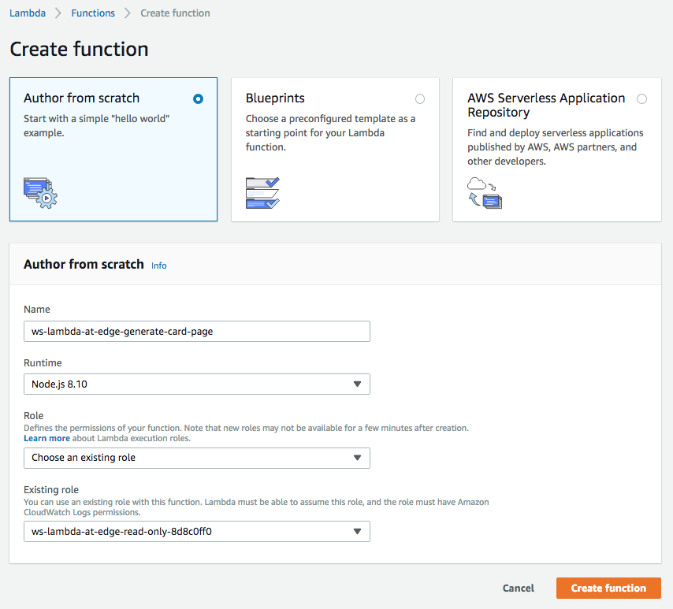</kbd>

 

Use JavaScript code from [ws-lambda-at-edge-generate-card-page.js](./ws-lambda-at-edge-generate-card-page.js) as a blueprint. Take a moment to familiarize yourself with the function code and what it does. You will need to replace `FIXME` with the DynamoDB table name. You can find the resource names in the CloudFormation stack details in [AWS CloudFormation Console](https://console.aws.amazon.com/cloudformation/home?region=us-east-1#/stacks?filter=active&tab=resources), or directly in [AWS DynamoDB Console](https://console.aws.amazon.com/dynamodb/home?region=us-east-1#tables:).

Show/hide the screehshot

  
<kbd>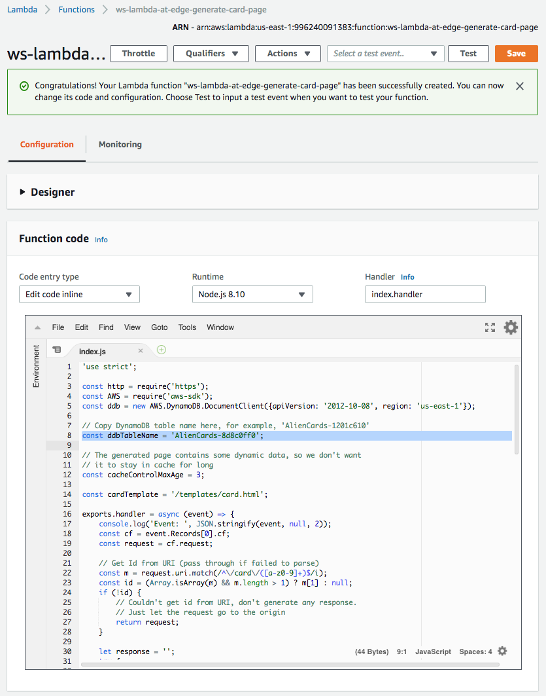</kbd>

#### 1.2 Validate the function works in Lambda Console

Click `Save`, then `Test`. Configure the test event. Use JSON object from [ws-lambda-at-edge-generate-card-page-test-event.json](./ws-lambda-at-edge-generate-card-page-test-event.json) as the test event.

Show/hide the screehshot

  
<kbd>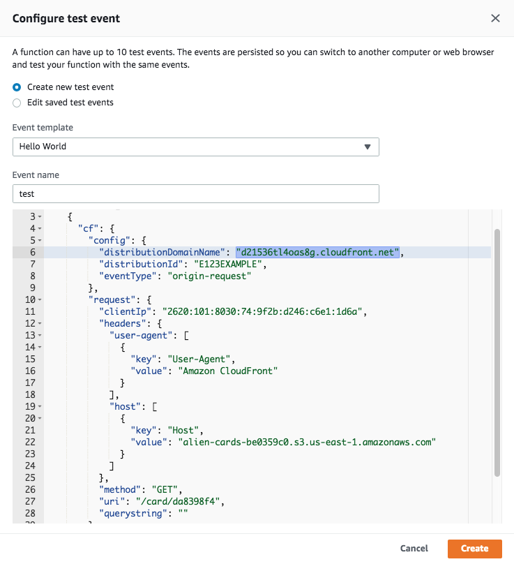</kbd>

 

Click `Test` and validate the function has returned `200` status code and the `body` field contains a meaningful HTML document.

Show/hide the screehshot

  
<kbd>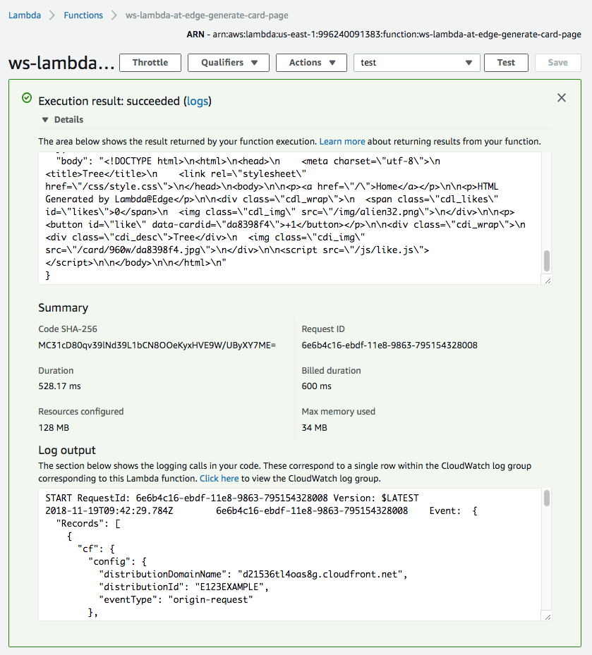</kbd>

#### 1.3 Deploy to Lambda@Edge

Select `Deploy to Lambda@Edge` under `Actions`.
Configure CloudFront trigger properties as shown below, acknowledge replication and click `Deploy`.

Field | Value
--- | ---
Distribution | Select the distribution created for this workshop
Cache beavior | `*` (the default cache bahavior matching all URI paths)
CloudFront event | `Origin request`

Show/hide the screehshot

  
<kbd>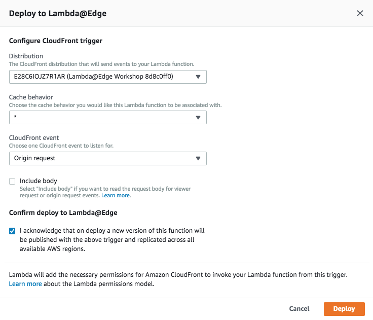</kbd>

 

The trigger has been successfully created.

Show/hide the screehshot

  
<kbd>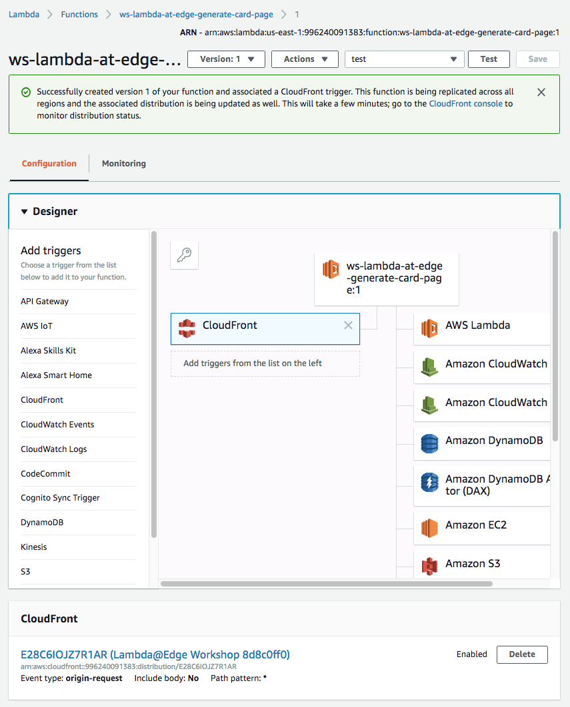</kbd>

#### 1.4 Wait for the change to propagate

Wait for 30-60 seconds for the change to propagate and for the Lambda@Edge function to get globally replicated.

After any modification of a CloudFront distribution, the change propagates globally to all CloudFront edge locations. The propagation status is indicated as `In Progress` and `Deployed` when it's complete. Usually 30-60 seconds is enough for the change to take effect, even though the status may be still `In Progress`. To be 100% certain though you can wait until the change is fully deployed, but it's not needed for the purpose of the workshop. You can monitor the status of your distribution in [AWS CloudFront Console](https://console.aws.amazon.com/cloudfront/home?region=us-east-1#).

#### 1.6 The generated card details page is now served by CloudFront

Go to the card details page:
https://d123.cloudfront.net/card/da8398f4  

You should be seeing a page like this:

<kbd>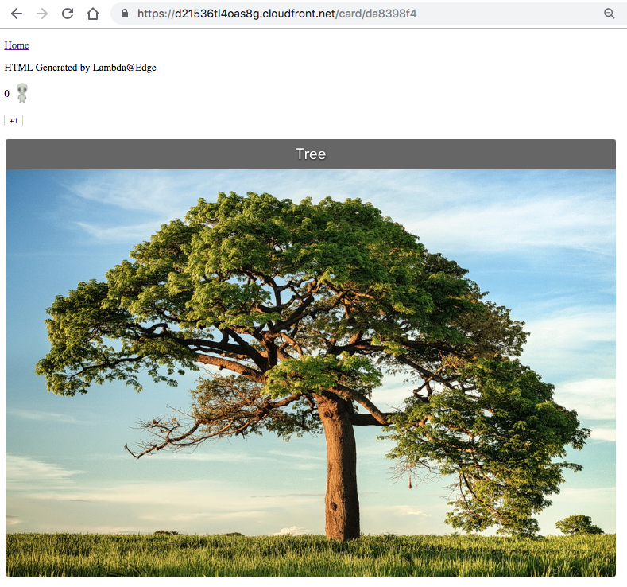</kbd>

### 2. Content generation for the home page

At the moment, the home page of our distribution displays a simple static HTML file. Let's make it more dynamic by generating it on the fly with Lambda@Edge so that the cards with the highest rating scrore appear on the top and also a short card description pop ups over the image when a mouse pointer is hovering over it.

The home page is available at:
https://d123.cloudfront.net/

#### 2.1 Create a cache behavior for the home page

Go to [AWS CloudFront Console](https://console.aws.amazon.com/cloudfront/home?region=us-east-1#) and find the distribution created for this workshop.

Under the `Behaviors` tab, click `Create Behavior`. Choose the following settings:

Field | Value
--- | ---
Path Pattern | `/index.html`
Viewer Protocol Policy | `Redirect HTTP to HTTPS`
Object Caching | `Customize`
Minimum TTL | `0`
Maximum TTL | `5`
Default TTL | `5`
  

Show/hide the screehshot

  
<kbd>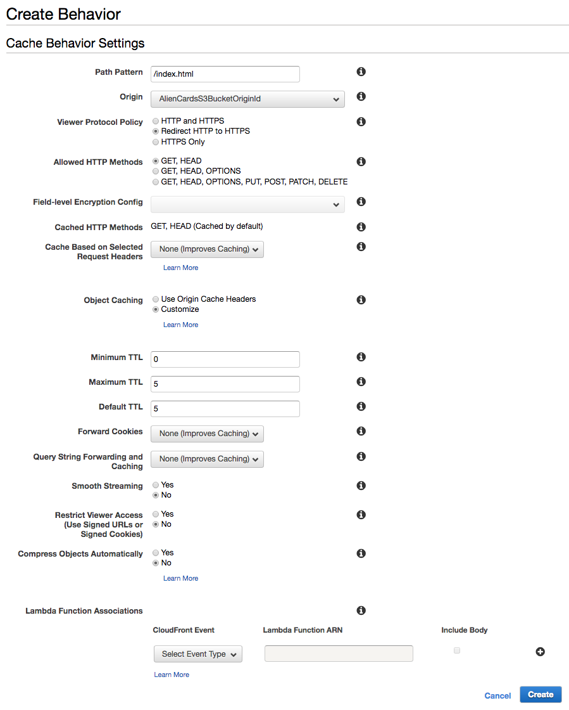</kbd>

 

Click `Create`.

Show/hide the screehshot

  
<kbd>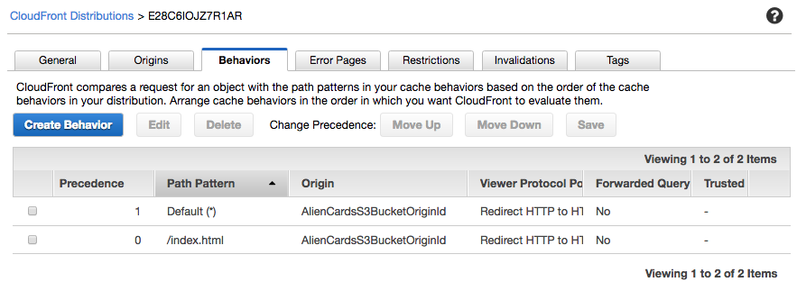</kbd>

#### 2.2 Create a lambda function

In [AWS Lambda Console](https://console.aws.amazon.com/lambda/home?region=us-east-1#/), go to `Functions`, click `Create function` and click `Author from scratch`.

In the `Create function` page, specify:

Field | Value
--- | ---
Name | `ws-lambda-at-edge-generate-home-page`
Runtime | `Node.js 8.10`
Role | `Choose an existing role`
Existing role | `ws-lambda-at-edge-read-only-<UNIQUE_ID>`

Show/hide the screehshot

  
<kbd>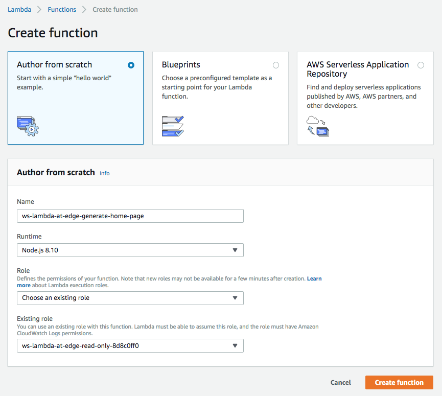</kbd>

 

Use JavaScript code from [ws-lambda-at-edge-generate-home-page.js](./ws-lambda-at-edge-generate-home-page.js) as a blueprint. Take a moment to familiarize yourself with the function code and what it does. You will need to replace `FIXME` with the DynamoDB table name created for this workshop.

Show/hide the screehshot

  
<kbd>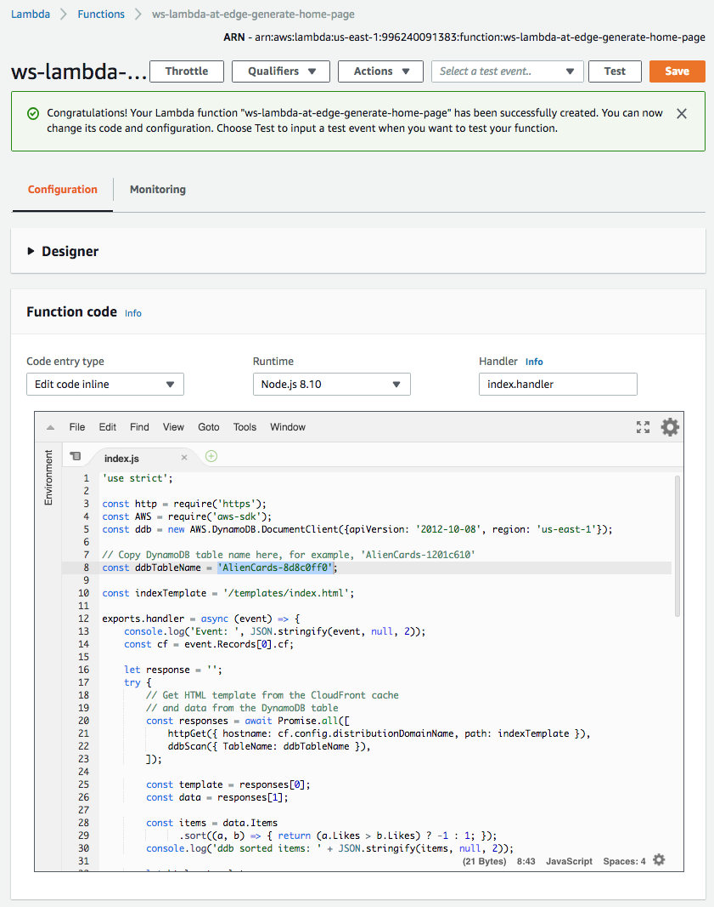</kbd>

#### 2.3 Validate the function works in Lambda Console

Click `Save`, then `Test`. Configure the test event. Use JSON object from [ws-lambda-at-edge-generate-home-page-test-event.json](./ws-lambda-at-edge-generate-card-home-test-event.json) as the test event.

Show/hide the screehshot

  
<kbd>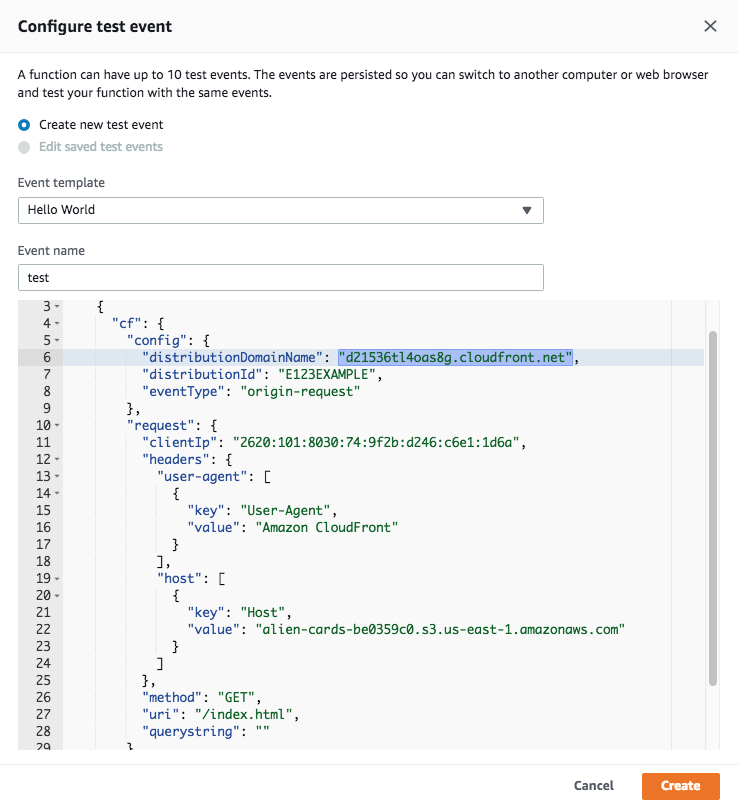</kbd>

 

Click `Test` and validate the function has returned `200` status code and the `body` field contains a meaningful HTML document.

Show/hide the screehshot

  
<kbd>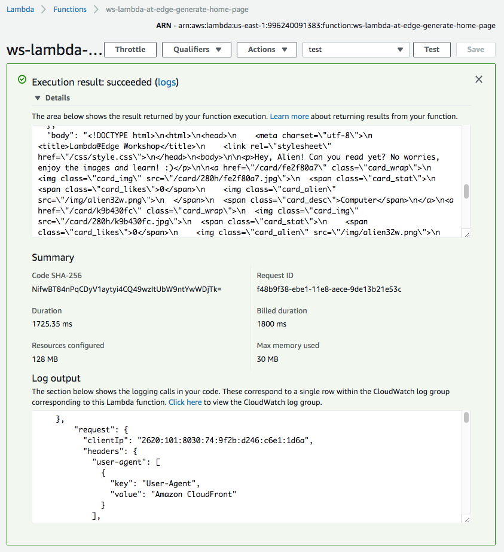</kbd>

#### 2.3 Deploy to Lambda@Edge

Select `Deploy to Lambda@Edge` under `Actions`.
Configure CloudFront trigger properties as shown below, acknowledge replication and click `Deploy`.

Field | Value
--- | ---
Distribution | Select the distribution created for this workshop
Cache beavior | `/index.html`
CloudFront event | `Origin request`

Show/hide the screehshot

  
<kbd>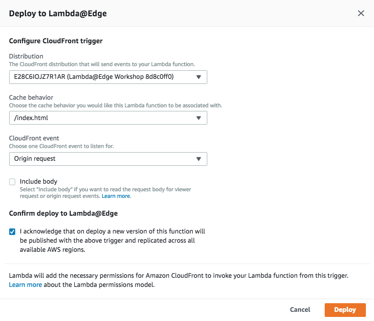</kbd>

 

The trigger has been successfully created.

Show/hide the screehshot

  
<kbd>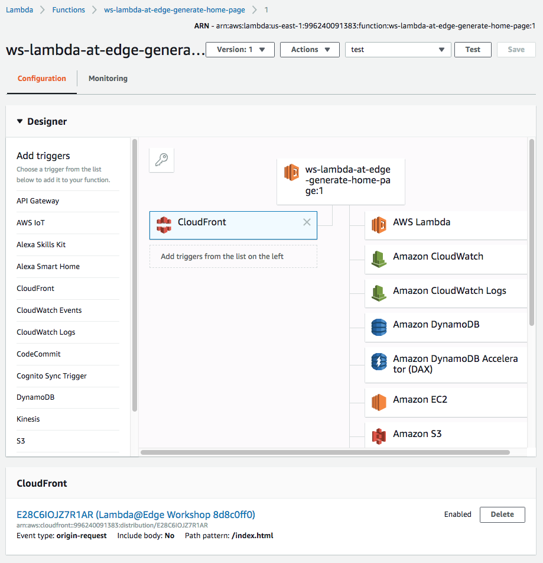</kbd>

#### 2.4 Wait for the change to propagate

Wait for 30-60 seconds for the change to propagate and for the Lambda@Edge function to get globally replicated.

#### 2.5 The generated home page is now served by CloudFront!

Go to the home page:  
https://d123.cloudfront.net/  

You should be seeing a page like this:

<kbd></kbd>
