## Lab 3: Simple API

In order to make our simple website a little bit more interactive let's accept some feedback from the viewers and reflect it in the dynamically generated pages. In the previous lab, we made our home page list the cards according to the rating scores, but we have not yet implemented a way for our viewers to submit the "+1" feedback.

In this lab, you will learn how you can use Lambda@Edge to implement a simple API that accepts POST requests from the viewers and modifies the web application state in a DynamoDB table.

Let's implement an API that accepts HTTP POST requests in the format below and increments the rating score of a card in the DynamoDB table:

```
POST /api/like?id=<card_id>
```

## Steps

[1. Create cache behavior for the API URI](#1-create-cache-behavior-for-the-api-uri)  
[2. Create a Lambda function](#2-create-a-lambda-function)  
[3. Validate the function works in Lambda Console](#3-validate-the-function-works-in-lambda-console)  
[4. Deploy to Lambda@Edge](#4-deploy-to-lambdaedge)  
[5. Wait for the change to propagate](#5-wait-for-the-change-to-propagate)  
[6. The API works now!](#6-the-api-works-now)  

### 1. Create cache behavior for the API URI

Go to [AWS CloudFront Console](https://console.aws.amazon.com/cloudfront/home?region=us-east-1#) and find the distribution created for this workshop.

Under the `Behaviors` tab, click `Create Behavior`. Choose the following settings:

Field | Value
--- | ---
Path Pattern | `/api/like`
Viewer Protocol Policy | `Redirect HTTP to HTTPS`
Allowed HTTP Methods | `GET, HEAD, OPTIONS, PUT, POST, PATCH, DELETE` (so that it includes `POST`)
Query String Forwarding and Caching | `Forward all, cache based on all`
  
<details><summary>Show/hide the screenshot</summary>
  
<kbd>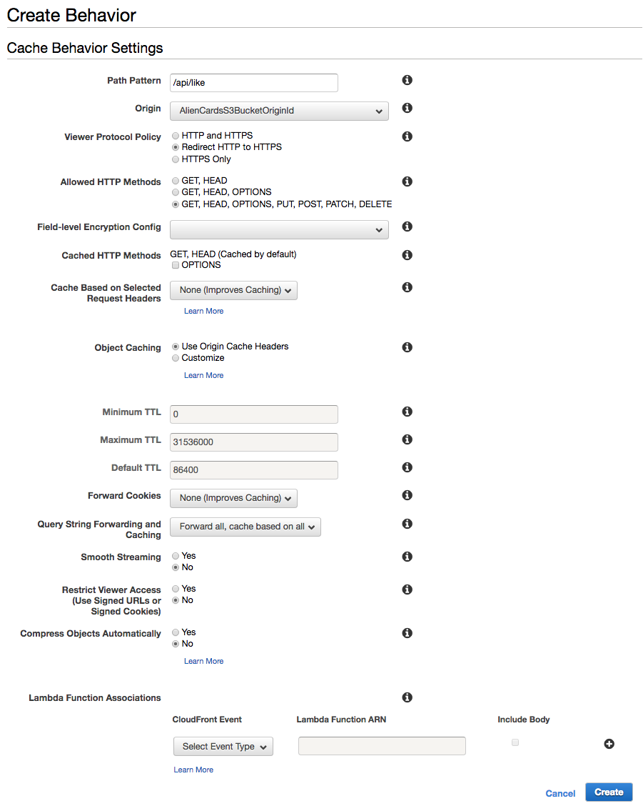</kbd>
</details><br/>

Click `Create`.

<details><summary>Show/hide the screenshot</summary>
  
<kbd>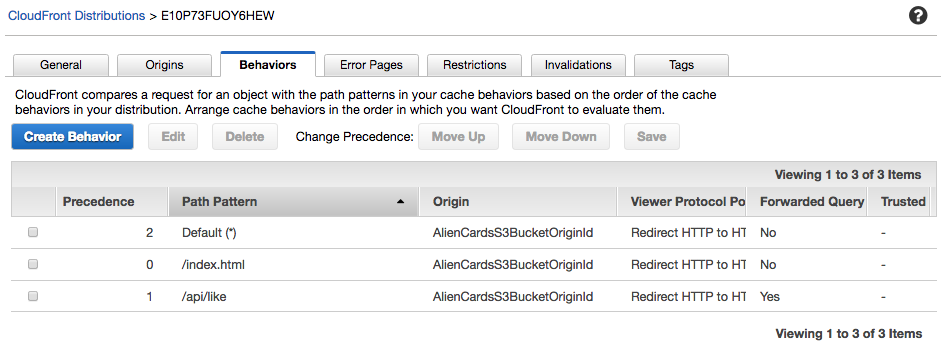</kbd>
</details>

### 2. Create a Lambda function

In [AWS Lambda Console](https://console.aws.amazon.com/lambda/home?region=us-east-1#/), go to `Functions`, click `Create function` and click `Author from scratch`.

In the `Create function` page, specify:

Field | Value
--- | ---
Name | `ws-lambda-at-edge-api-like`
Runtime | `Node.js 8.10`
Role | `Choose an existing role`
Existing role | `ws-lambda-at-edge-full-access-<UNIQUE_ID>` (this role allows the function to update the DynamoDB table)

<details><summary>Show/hide the screenshot</summary>
  
<kbd>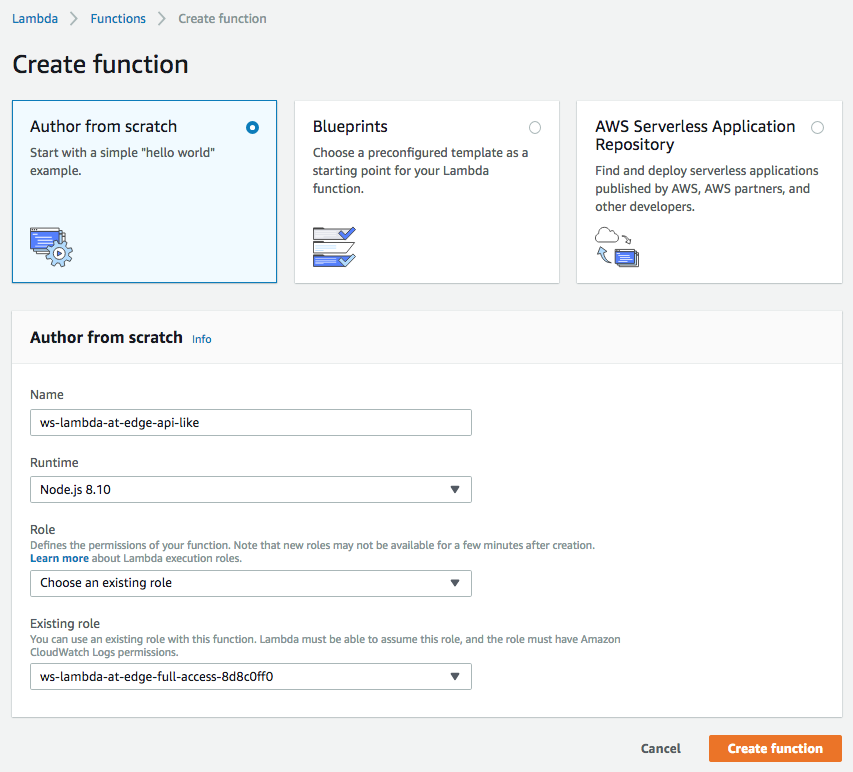</kbd>
</details><br/>

Use JavaScript code from [ws-lambda-at-edge-api-like.js](./ws-lambda-at-edge-api-like.js) as a blueprint. Take a moment to familiarize yourself with the function code and what it does. You will need to replace `FIXME` with the DynamoDB table name created for this workshop.

<details><summary>Show/hide the screenshot</summary>
  
<kbd>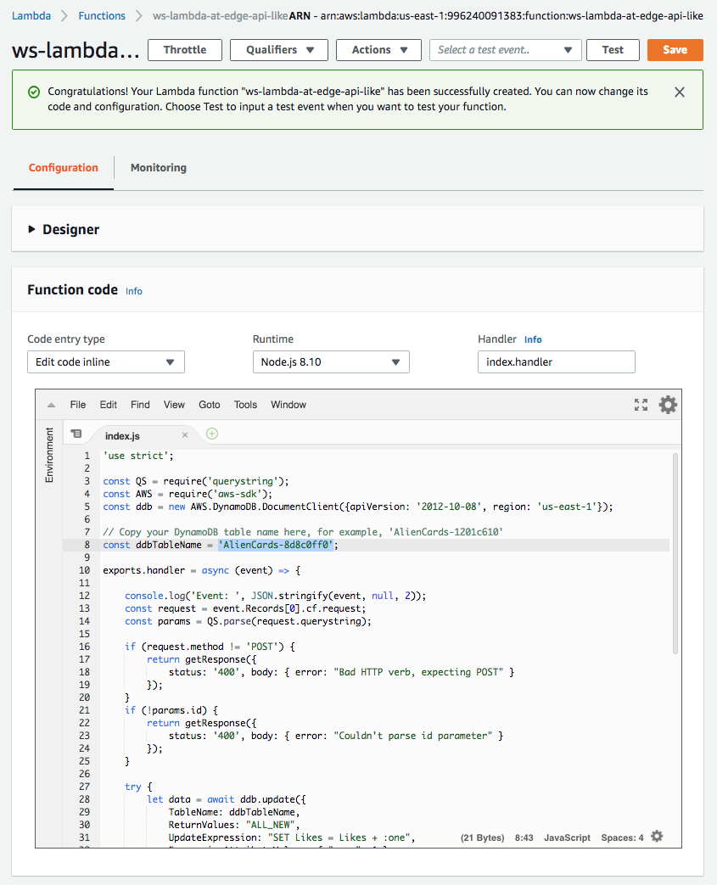</kbd>
</details>

### 3. Validate the function works in Lambda Console

Click `Save`, then `Test`. Configure the test event. Use JSON object from [ws-lambda-at-edge-api-like-test-event.json](./ws-lambda-at-edge-api-like-test-event.json) as the test event. Notice the values of `method`, `uri` and `querystring` fields.

<details><summary>Show/hide the screenshot</summary>
  
<kbd>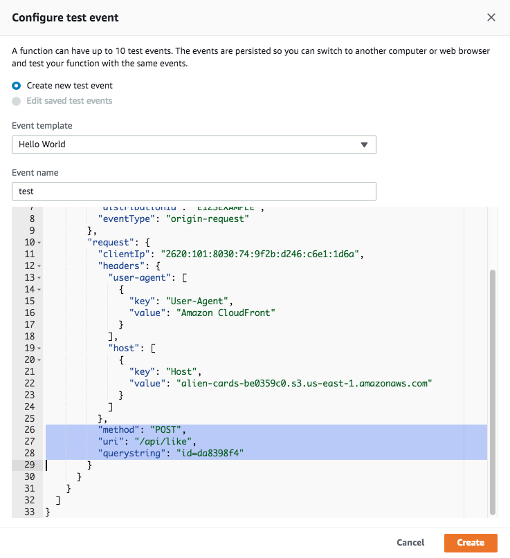</kbd>
</details><br/>

Click `Test` and validate the function has returned `200` status code and the `body` field contains a meaningful JSON document.

<details><summary>Show/hide the screenshot</summary>
  
<kbd>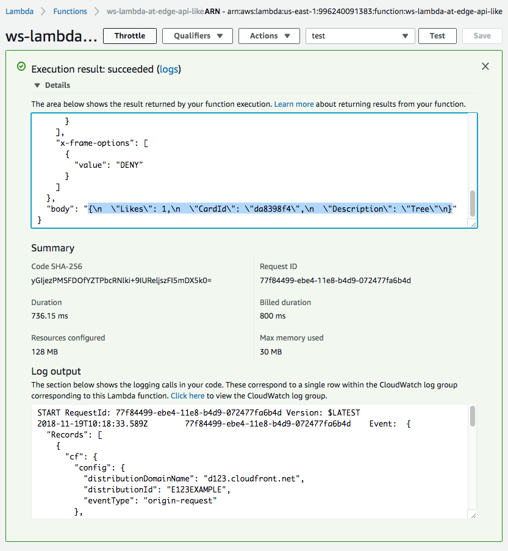</kbd>
</details>

### 4. Deploy to Lambda@Edge

Select `Deploy to Lambda@Edge` under `Actions`.
Configure CloudFront trigger properties as shown below, acknowledge replication and click `Deploy`.

Field | Value
--- | ---
Distribution | Select the distribution created for this workshop
Cache beavior | `/api/like`
CloudFront event | `Origin request`

<details><summary>Show/hide the screenshot</summary>
  
<kbd>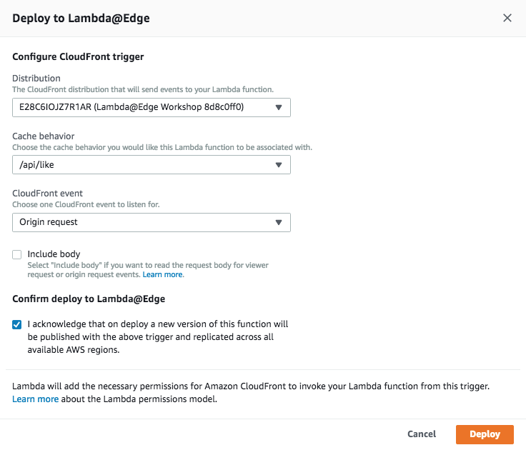</kbd>
</details><br/>

The trigger has been successfully created.

<details><summary>Show/hide the screenshot</summary>
  
<kbd>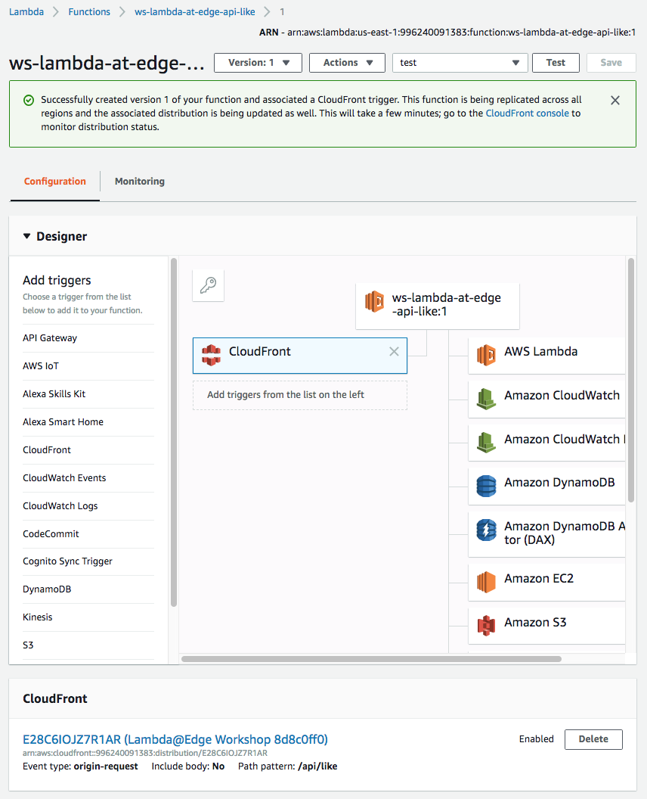</kbd>
</details>

### 5. Wait for the change to propagate

Wait for 30-60 seconds for the change to propagate and for the Lambda@Edge function to get globally replicated.

After any modification of a CloudFront distribution, the change propagates globally to all CloudFront edge locations. The propagation status is indicated as `In Progress` and `Deployed` when it's complete. Usually 30-60 seconds is enough for the change to take effect, even though the status may be still `In Progress`. To be 100% certain though you can wait until the change is fully deployed, but it's not needed for the purpose of the workshop. You can monitor the status of your distribution in [AWS CloudFront Console](https://console.aws.amazon.com/cloudfront/home?region=us-east-1#).

### 6. The API works now!

You can validate it with either a command line:

```
curl -X POST https://d123.cloudfront.net/api/like?id=da8398f4

{
  "Likes": 4,
  "CardId": "da8398f4",
  "Description": "Tree"
}
```

Or simply go to https://d123.cloudfront.net/card/da8398f4 in your web browser and click "+1"

<kbd>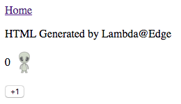</kbd>

becomes:

<kbd>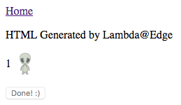</kbd>

The home page should also now reflect the change and list the cards according to their rating:

<kbd>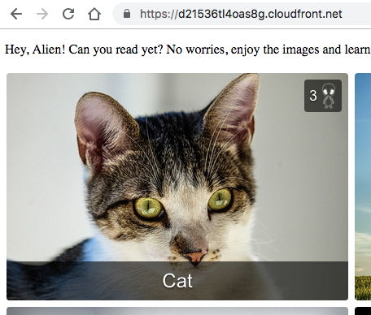</kbd>
