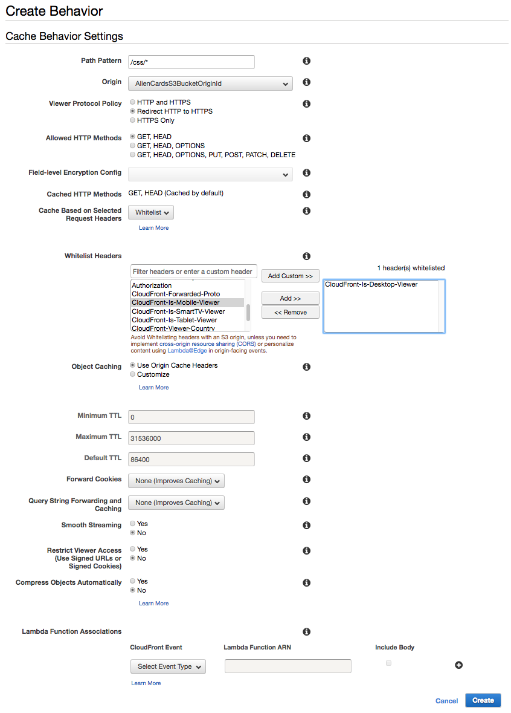
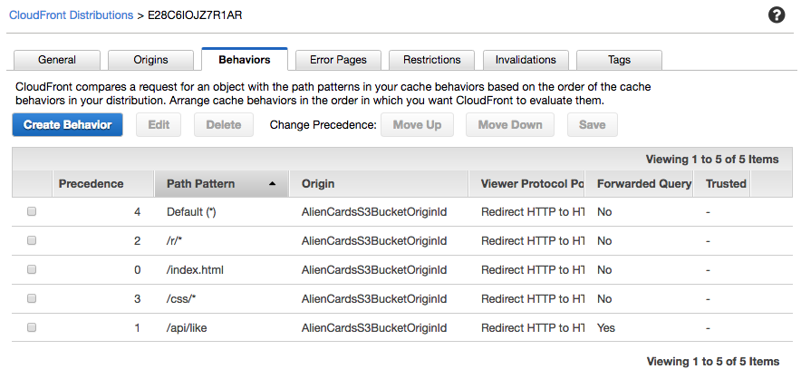
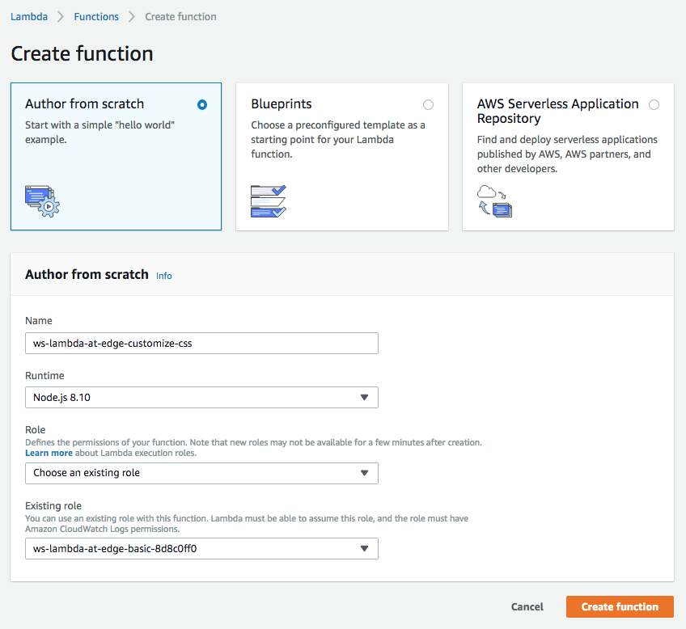
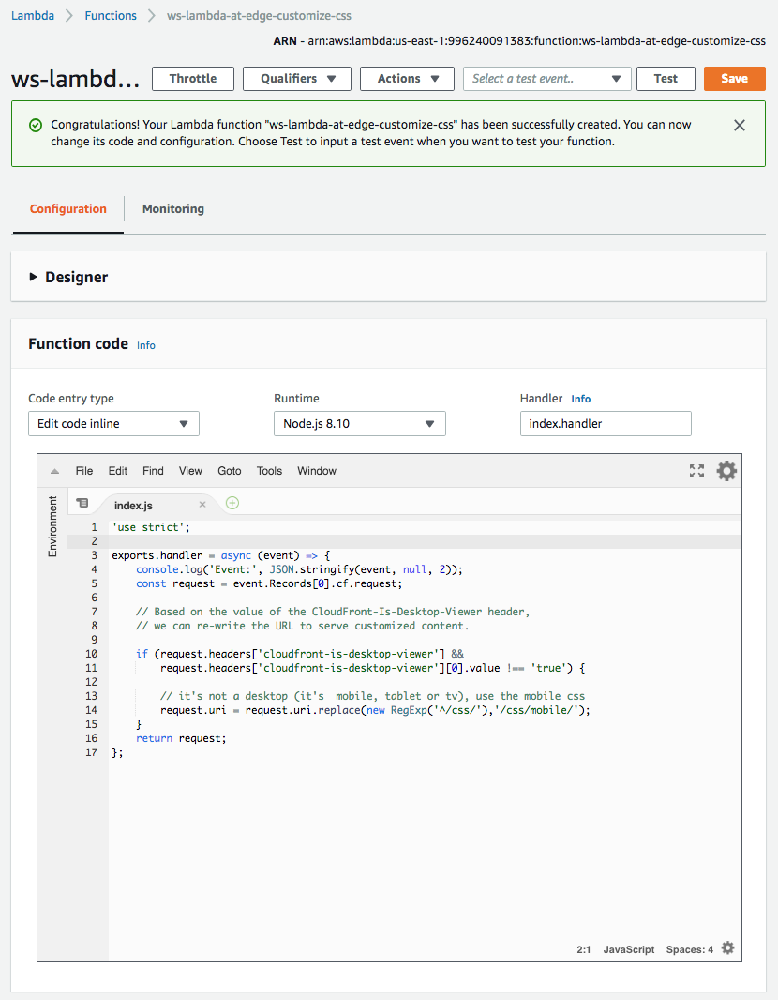
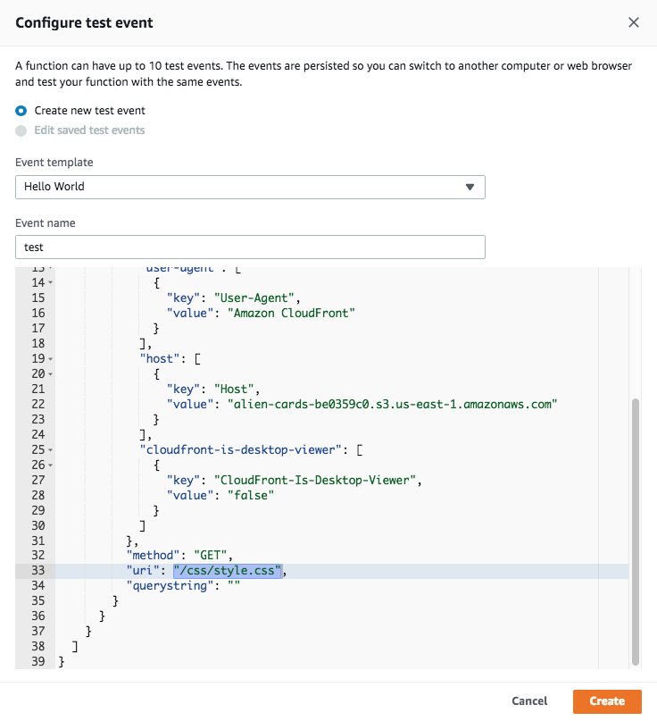
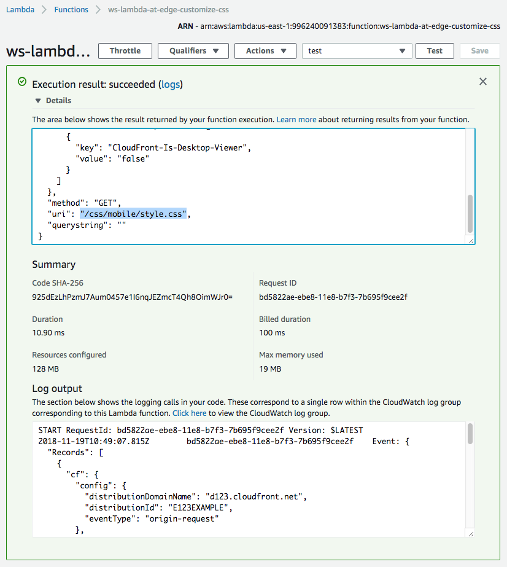
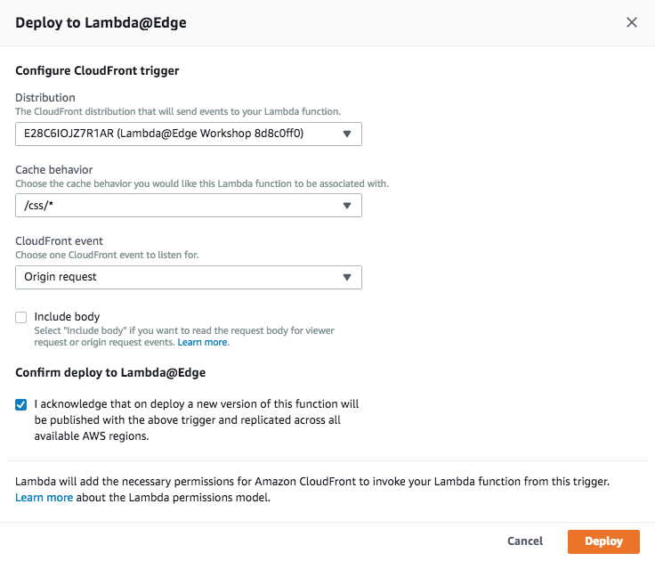
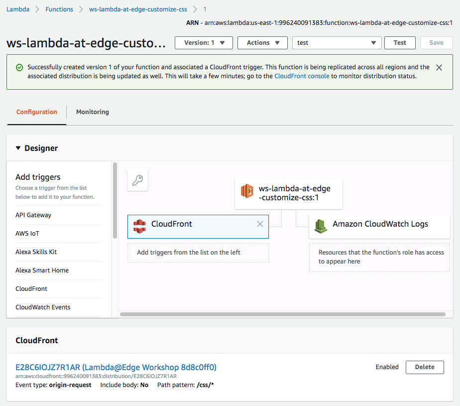
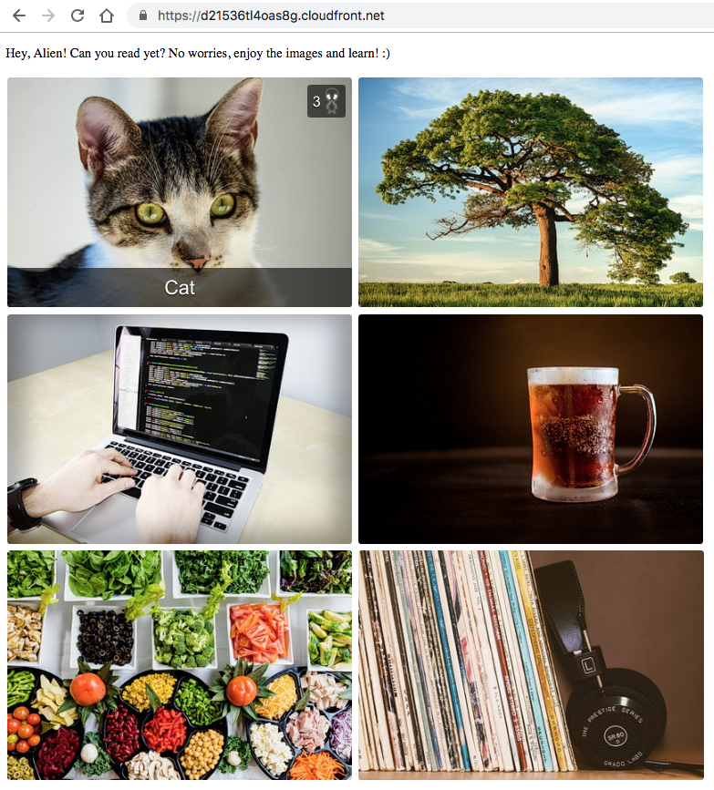
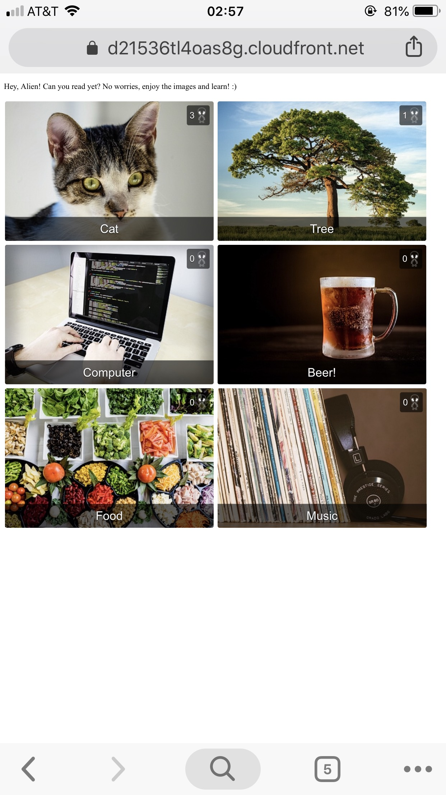

## Lab 5 - Content Customization

In this lab, you will learn how to create a Lambda@Edge function that customizes the content based on viewer device properties.

If you open the homepage of the CloudFront distribution, you set up in previous steps, on a mobile phone, you won't be able to see card descriptions and ratings as you can't hover over an HTML element without a pointer device on a mobile phone. If you try to hover, you may end up clicking it and landing on the detail page. While popping up elements look cool on a desktop, this is a poor viewer experience on a mobile device. We can fix this by keeping the hover effect only for desktop devices, while disaling it for mobile viewers who can just always see all descritpions and ratings without hovering over them.

In this lab, you will serve different CSS based on viewer device type. If a request if comes from a mobile device, you will serve a different CSS which always show the title and ratings on home page. 

You can serve customized content from an S3 bucket by changing the path prefix depending on the CloudFront device type headers like:
* CloudFront-Is-Mobile-Viewer
* CloudFront-Is-Desktop-Viewer

For example:

* GET /css/style.css

can be rewritten to

* GET /css/style.css (for desktop viewers)
* GET /css/mobile/style.css (for mobile viewers)

## Steps

[1. Create a new cache behavior for the CSS files](#1-create-a-new-cache-behavior-for-the-css-files)  
[2. Create a Lambda function](#2-create-a-lambda-function)  
[3. Validate the function works in Lambda Console](#3-validate-the-function-works-in-lambda-console)  
[4. Deploy to Lambda@Edge](#4-deploy-to-lambdaedge)  
[5. The generated home page is now delivering CSS customized for the device type!](#5-the-generated-home-page-is-now-delivering-css-customized-for-the-device-type)

### 1. Create a new cache behavior for the CSS files

Go to [AWS CloudFront Console](https://console.aws.amazon.com/cloudfront/home?region=us-east-1#) and find the distribution created for this workshop.

Under the `Behaviors` tab, click `Create Behavior`. Choose the following settings:

Field | Value
--- | ---
Path Pattern | `/css/*`
Viewer Protocol Policy | `Redirect HTTP to HTTPS`
Cache Based on Selected Request Headers | `Whitelist`
Whitelist Headers | `CloudFront-Is-Desktop-Viewer`

Show/hide the screenshot

  
<kbd></kbd>

 

Click `Create`.

Show/hide the screenshot

  
<kbd></kbd>

### 2. Create a Lambda function

In [AWS Lambda Console](https://console.aws.amazon.com/lambda/home?region=us-east-1#/), go to `Functions`, click `Create function` and click `Author from scratch`.

In the `Create function` page, specify:

Field | Value
--- | ---
Name | `ws-lambda-at-edge-customize-css`
Runtime | `Node.js 8.10`
Role | `Choose an existing role`
Existing role | `ws-lambda-at-edge-basic-<UNIQUE_ID>`

Show/hide the screenshot

  
<kbd></kbd>

 

Use JavaScript code from [ws-lambda-at-edge-customize-css.js](./ws-lambda-at-edge-customize-css.js) as a blueprint.
Take a moment to familiarize yourself with the function code and what it does.

Show/hide the screenshot

  
<kbd></kbd>

### 3. Validate the function works in Lambda Console

Click `Save`, then `Test`. Configure the test event. Use JSON object from [ws-lambda-at-edge-customize-css-test-event.json](./ws-lambda-at-edge-customize-css-test-event.json) as the test event. Notice the `CloudFront-Is-Desktop-Viewer` header is `false`, and the `uri` field is `css/style.css`.

Show/hide the screenshot

  
<kbd></kbd>

 

Click `Test`. Validate the function executed sucessfully and the `uri` field has been updated to `/css/mobile/style.css`.

Show/hide the screenshot

  
<kbd></kbd>

### 4. Deploy to Lambda@Edge

Select `Deploy to Lambda@Edge` under `Actions`.
Configure CloudFront trigger properties as shown below, acknowledge replication and click `Deploy`.

Field | Value
--- | ---
Distribution | Select the distribution created for this workshop
Cache beavior | `/css/*`
CloudFront event | `Origin request`

Show/hide the screenshot

  
<kbd></kbd>

 

The trigger has been successfully created.

Show/hide the screenshot

  
<kbd></kbd>

Wait for ~30-60 seconds for the change to propagate and for the Lambda@Edge function to get globally replicated.

### 5. The generated home page is now delivering CSS customized for the device type!

Go to the distribution home page (from desktop):  
https://d123.cloudfront.net/

You should be seeing a page like this:

<kbd></kbd>

Go to the distribution home page (from mobile):  
https://d123.cloudfront.net/

You should be seeing a page like this:

<kbd></kbd>

